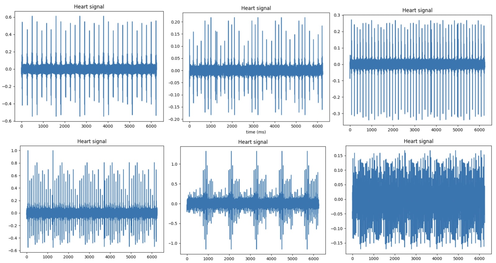
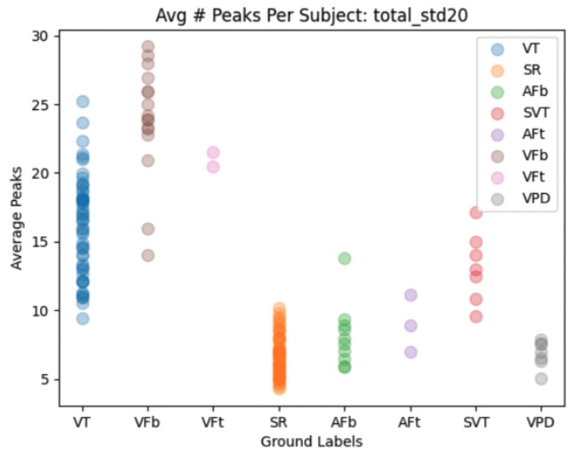
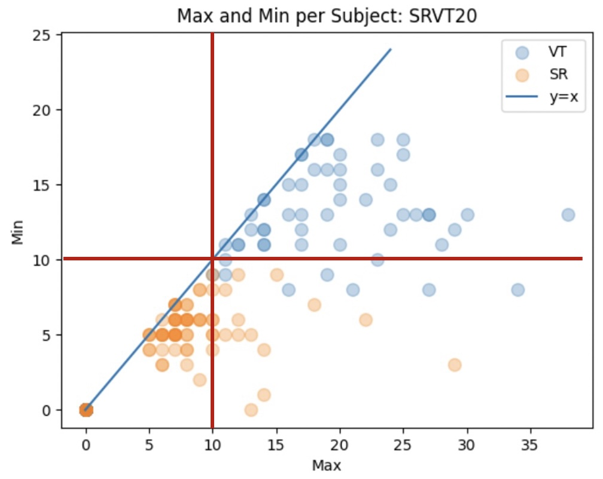
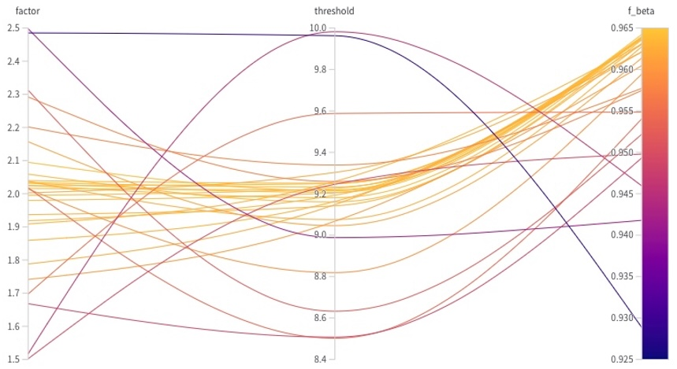
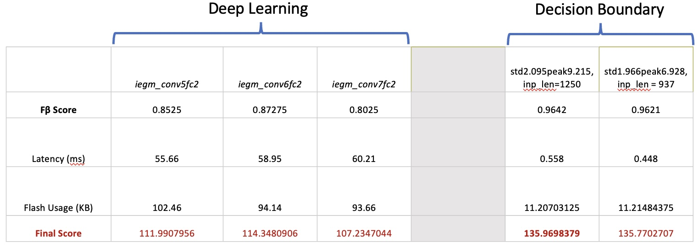

# Code for the ACM/IEEE TinyML Contest at ICCAD 2022

## Getting Started

### Installation
First, let's set up environment!
    
- numpy
- argparse
- torch
- torchvision
- tqdm

### Data
Samples of waveforms that record the heart signals over time. Pictured images all have unique labels. 

Data should be placed in the home directory with the path `./data/[label,filename]` such as `./data/0,S27-SR-1.txt`.

For inquires on getting access to data, please visit the [Contest Website](https://tinymlcontest.github.io/TinyML-Design-Contest/).
    
## Training and Evaluation
    
    python train.py --tqdm_ # show progress bar
    python train.py --ensemble # define multiple threshold points as ensembles

## Methods

### Peak Detection with Standard Deviation 
The `factor` parameter scales the standard deviation of the waveform to obtain the peak detection value.
It is defined by a simple equation `peak_detection_value = waveform.std() * 2.0`. Points in the waveform that are bigger than this value are recongized as peaks.
The average number of peaks for different labels is shown:

### Peak Separation via Decision Boundary
The 'threshold' parameter is a decision boundary that we use to classify whether or not the waveform is VA (positive) or non-VA (negative). 
The VT and SR are representative labels that comprise ~84% of the total data. The separation result with `threshold = 10` and `factor = 2.0` is illustrated:

- Maximum and Minimum values of the waveform is plotted with each of the sample representing a unique subject. The high transparency of the samples mean less number of subjects for that bin and vice-versa.
Algorithmically, the first quadrant classifies VA while third quadrant classifies non-VA. The fourth quadrant is prone for misclassification. 

### Hyperparameter Tuning with Bayesian Search

## Results

